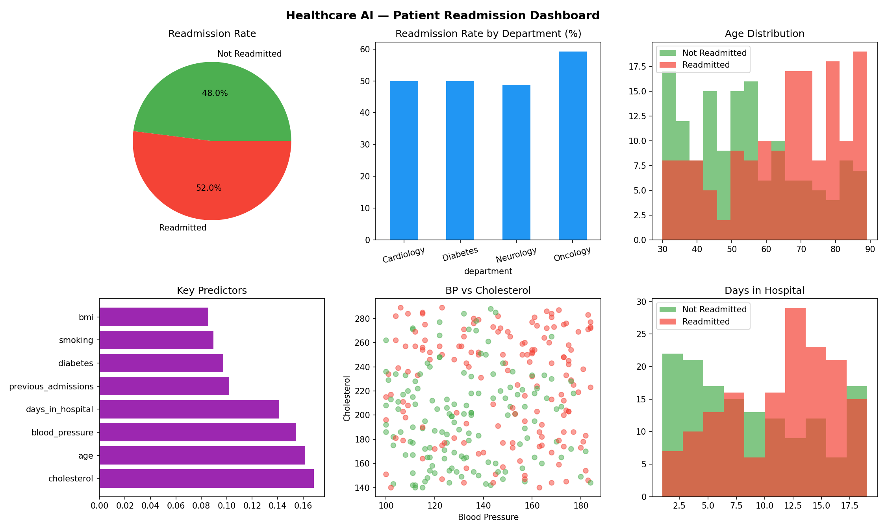

# Healthcare AI — Patient Readmission Prediction 🏥🤖

## Overview

A machine learning system that predicts hospital patient readmission risk using clinical and demographic features. The project combines exploratory data analysis, a trained classification model, and a multi-panel clinical dashboard, built to demonstrate the application of AI to real healthcare decision-making problems.

Developed as part of an active transition into Healthcare AI and Clinical Data roles.

## Key Results

- **Random Forest model accuracy: 90%**
- Identified the strongest readmission predictors: **cholesterol, age, and blood pressure**
- Analysed readmission patterns across 4 departments (Cardiology, Diabetes, Neurology, Oncology)
- **Oncology showed the highest readmission rate (~60%)**
- Generated an automated 6-panel clinical dashboard and an Excel report

## Features

- Builds a structured clinical dataset of 300 patient records (age, blood pressure, cholesterol, BMI, length of stay, diabetes, smoking, previous admissions, department)
- Exploratory analysis: readmission rates by department, high-risk patient identification (age > 65, BP > 155, diabetes)
- Trains a Random Forest Classifier (100 trees) on 7 clinical features
- Feature importance ranking to explain which factors drive readmission
- 6-panel visual dashboard: readmission rate, rate by department, age distribution, key predictors, BP vs cholesterol, length of stay
- Automated export to PNG dashboard + Excel report

## Tech Stack

- **Python 3**
- **Pandas / NumPy** — data handling and structuring
- **Scikit-learn** — Random Forest classification, train/test split, evaluation metrics
- **Matplotlib** — multi-panel data visualization
- **OpenPyXL** — Excel report export
- **Google Colab** — development environment

## Dashboard Preview

## Files

| File | Description |
| ---- | ----------- |
| `healthcare_ai_readmission.ipynb` | Full analysis notebook: data, EDA, model, dashboard |
| `healthcare_ai_dashboard.png` | Generated 6-panel clinical dashboard |
| `healthcare_ai_report.xlsx` | Generated Excel report |

## Note on Data

This project uses a synthetic dataset generated with realistic clinical value ranges. No real patient data is used, in line with healthcare data privacy principles (GDPR / NHS information governance). The methodology is directly transferable to real clinical datasets.

## Background

Built by a certified Healthcare Assistant (UK — NHS & private sector) transitioning into AI / Healthcare AI roles. This project demonstrates the direct application of clinical domain knowledge to machine learning and data-driven decision support.

## Status

Completed — June 2026
